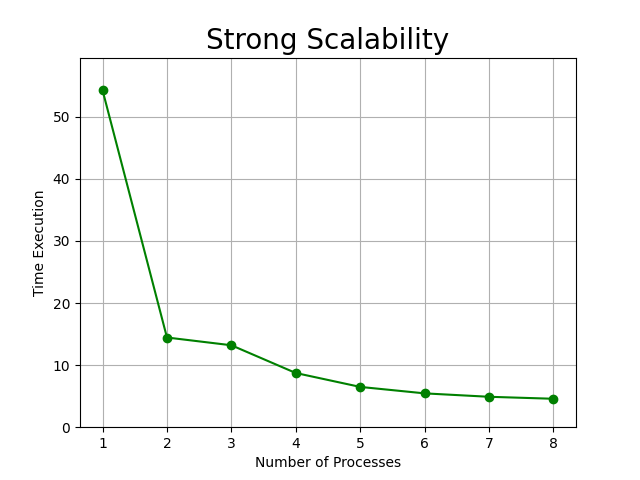
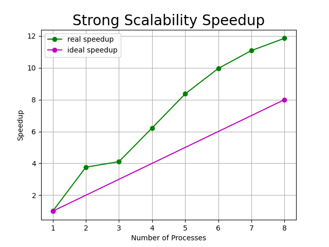
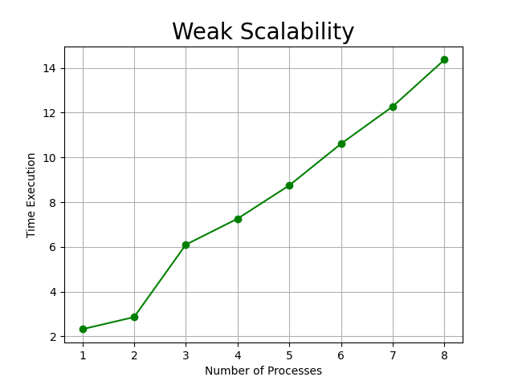
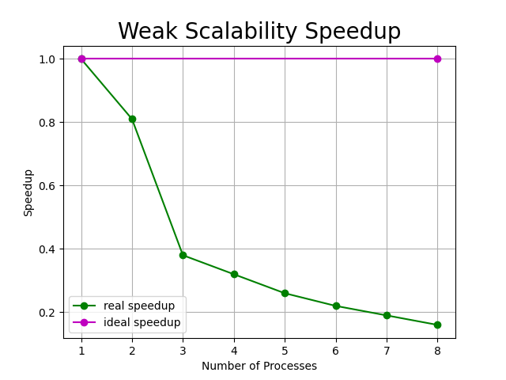

# WordCount

### Introduzione
- Studente: Alessia Natale 
- Matricola: 0522501110
- Istanze AWS: m4.xlarge

## Indice
- [Problema](#problema)
- [Installazione](#installazione)
- [Soluzione proposta](#soluzione-proposta)
  * [Dettagli implementazione](#dettagli-implementazione)
- [Correttezza](#correttezza)
- [Benchmark](#benchmark)
  * [Strong Scalability](#strong-scalability)
  * [Weak Scalability](#weak-scalability)
- [Conclusioni](#conclusioni)

## Problema
Il progetto prevede la realizzazione di un programma che conti il numero di parole all'interno di file di testo utilizzando un approccio parallelo e distribuito attraverso Open MPI.
In particolare il programma è diviso in 3 step:
- il master legge la directory contenente tutti i file di testo e divide i file in modo tale che ogni processore ne avrà una parte da cui dovrà contare la frequenza con la quale si ripete ogni parola
- i processori inviano le frequenze al master che le combinerà insieme
- il master crea un file csv contenente tutte le parole con le relative frequenze

## Installazione
L'esecuzione del programma può essere fatta attraverso due versioni:
- **wordcount.c**: versione classica di WordCount
- **wordcount_test.c**: versione con l'aggiunta del salvataggio delle prestazioni per la scalabilità forte e debole

In particolare eseguire i seguenti comandi:

- **wordcount.c**:
```
mpicc wordcount.c -o wordcount

mpirun -np <NP> wordcount <DIR> <RES>
```
- **wordcount_test.c**:
```
mpicc wordcount_test.c -o wordcount_test

mpirun -np <NP> wordcount <DIR> <RES> <STRONG/WEAK>
```
> Nota: prima di eseguire per la prima volta wordcount_test è necessario eseguire create.c per la creazione dei file csv dove verranno salvati i dati sulle prestazioni
> ```
> gcc create.c -o create
> ./create
> ```

Dove i parametri sono:
- **NP**: numero di processi
- **DIR**: directory dove sono presenti i file .txt
- **RES**: file csv dove vengono salvate le parole e le frequenze
- **STRONG/WEAK**: file csv dove vengono salvati i risultati delle prestazioni

> Nota: un'alternativa di esecuzione è il makefile, quindi digitare il seguente comando:
> 
> (cambiare i path dei parametri nel makefile se necessario)
> ```
> make
> ``` 

## Soluzione proposta
La realizzazione del progamma che conta il numero di parole all'interno di file di testo è stata fatta eseguendo una divisione dei file attraverso il numero di parole, in particolare vengono prese e salvate tutte le parole di ciascun file e, successivamente, vengono divise in base al numero totale tra i vari processori.

Le parole vengono estratte dai file di testo senza vincoli di formattazione, non è necessario che siano divise solo da spazi, ma può essere presente qualsiasi segno di punteggiatura che separa le parole, di seguito i delimitatori considerati:
```c
const char arraydelim[] = " ,;.:-—_°#|*'’^<>«»!?\"=\n\r()[]{}\n";
```
La soluzione proposta prevede quindi l'utilizzo di due strutture, una per i file di testo e una per le parole:
```c
typedef struct {
    char name[100];
} file;
```
Viene quindi creato un array di 'file' dove il 'name' di ogni file può avere fino a 100 caratteri.

```c
#define MAX_LETTERS 50
typedef struct {
    char letters[MAX_LETTERS];
    int frequency;
    int nwords;
} word;
```
Per le parole invece nella struct 'word' c'è:
- letters: array di caratteri che compongono la parola
- frequency: frequenza con la quale si ripete la parola
- nwords: numero di parole che contiene la struct

L'implementazione consiste dei seguenti step:

1. Salvataggio parole e divisione per processori

2. Invio porzione di parole ai processori

3. Conteggio frequenze ed invio al MASTER

4. Conteggio frequenze totali e creazione csv

### Dettagli implementazione
**1. Salvataggio parole e divisione per processori**

Dopo aver preso ogni file di testo e salvato nell'array **files**
- per salvare le parole viene utilizzata la seguente funzione:
```c
word *words;
words = insertWords(nfiles, files);
```
dove al suo interno vengono prese le parole ignorando i segni di punteggiatura con la funzione **strtok** e salvate in **words**.

- per dividere le parole tra i processi viene utilizzata la seguente funzione:
```c
splitWords(words->nwords, nproc, elements_per_process, displs);
```
dove vengono salvati il numero di parole per ogni processore in **elements_per_process** e i displacements in **displs**.


**2. Invio porzione di parole ai processori**

Per inviare la parte di parole ad ogni processore viene utilizzata la Scatterv:
```c
MPI_Scatterv(words, elements_per_process, displs, MPI_WORD, recvwords, nwordsproc, MPI_WORD, 0, MPI_COMM_WORLD);
```
In questo modo **recvwords** (struct word) contiene solo un certo numero di parole, calcolato precedentemente in base al numero di processori.


**3. Conteggio frequenze ed invio al MASTER**

- A questo punto ciascun processore conta le frequenze di ogni porzione proprio, utilizzando la funzione:
```c
countFrequency(nwordsproc, recvwords);
```
In particolare questa funzione trova tutte le parole uguali ed incrementa la frequenza relativa a quella determinata parola.

- Ora è possibile inviare al MASTER le porzioni di parole con le frequenze aggiornate:
```c
if(rank==0) {
   MPI_Isend(&nwordsproc, 1, MPI_INT, 0, 66, MPI_COMM_WORLD, &reqnumber);
   MPI_Isend(recvwords, nwordsproc, MPI_WORD, 0, 55, MPI_COMM_WORLD, &reqwords);
} else {
   MPI_Send(&nwordsproc, 1, MPI_INT, 0, 88, MPI_COMM_WORLD);
   MPI_Send(recvwords, nwordsproc, MPI_WORD, 0, 77, MPI_COMM_WORLD); 
}
```
Viene inviato anche il numero nuovo di parole che contiene ogni porzione (per poter allocare la memoria della strcut word contenente tutte le frequenze totali).


**4. Conteggio frequenze totali e creazione csv**

Per contare le frequenze totali viene utilizzata una struct word **wordcountotal** che viene prima inizializzata con le parole del rank 0 e, successivamente, vengono aggiunte tutte le altre parole provenienti dagli altri processi:
```c
word *wordcountproc, *wordcountotal;
int newords[nproc];
int totwords;

// initializing the word struct containing the total frequencies
// here the frequencies of rank 0
MPI_Recv(&newords[0], 1, MPI_INT, 0, 66, MPI_COMM_WORLD, NULL);
wordcountproc = malloc(sizeof(word)* newords[0]);
wordcountotal = malloc(sizeof(word)* newords[0]);
MPI_Recv(wordcountotal, newords[0], MPI_WORD, 0, 55, MPI_COMM_WORLD, NULL);
        
totwords = wordcountotal->nwords;

// receiving the words from each proc and putting them together
for(int i=1; i<nproc; i++) {
    MPI_Recv(&newords[i], 1, MPI_INT, i, 88, MPI_COMM_WORLD, NULL);
    totwords += newords[i];
    wordcountotal = realloc(wordcountotal, sizeof(word)*totwords);
    wordcountproc = realloc(wordcountproc, sizeof(word)*newords[i]);
    MPI_Recv(wordcountproc, newords[i], MPI_WORD, i, 77, MPI_COMM_WORLD, NULL);

    for(int j=0; j<newords[i]; j++)
        wordcountotal[totwords-newords[i]+j] = wordcountproc[j];
}
```
A questo punto richiamiamo la funzione **countFrequency** per contare le frequenze finali:
```c
countFrequency(totwords, wordcountotal);
```
Infine salviamo i risultati in un file csv specificato in input.

## Correttezza
Per verificare la correttezza del programma sono stati fatti due test:
- il primo test prevede l'utilizzo del file **'250nomi_propri.txt'** in **files_correctness** che contiene appunto 250 parole (nomi) 

**output**:


...


Possiamo notare che il file csv contiene 250 parole (251-1 la prima riga è il titolo) quindi ha stampato correttamente tutte le parole.

- il secondo test prevede l'utilizzo del file **'3parole.txt'** in **files_correctness** che contiene le parole 'gatto' - 'cane' - 'verde' ripetute 10 volte in ordine casuale nel file

**output**:


Dall'output osserviamo che le tre parole sono presenti con tutte frequenza uguale a 10.

> Nota: i test mostrati sono stati effettuati su input piccoli per facilitarne la comprensione

## Benchmark
I benchmark sono stati eseguiti su un cluster AWS di 2 istanze m4.xlarge utilizzando i file di testo presenti nelle cartelle **files** e **files_weak**.

Di seguito sono riportati i risultati sia per la strong scalability - stessa grandezza di input ma aumentando il numero di processori, sia per la weak scalability - grandezza di input che aumenta in modo costante con il numero di processori.

La metrica utilizzata per misurare i risultati è lo **speedup** calcolato come segue:

`t(1) \ t(N)`

Dove t(1) è il tempo di esecuzione con un processore, mentre t(N) con N processori.

> Le misurazioni sono state effettuate più volte, i tempi mostrati sono una media di tutti i valori registrati.

### Strong Scalability
La misurazione della Strong Scalability è stata effettuata eseguendo il programma utilizzando come input i file di testo presenti nella cartella **files**.

Di seguito sono riportati i risultati:
| NP| Time (Sec) | Speedup
|:---:|:---:|:---:|
1|54.29|1.0
2|14.45|3.76
3|13.20|4.11
4|8.73|6.22
5|6.49|8.36
6|5.45|9.96
7|4.90|11.08
8|4.58|11.85





### Weak Scalability
La misurazione della Weak Scalability è stata effettuata eseguendo il programma utilizzando come input i file di testo presenti nella cartella **files_weak** nella quale sono presenti file di testo il cui numero di parole aumenta di 6307 all'aumentare del numero di processori.

Di seguito sono riportati i risultati:
| NP| Time (Sec) | N words | Speedup
|:---:|:---:|:---:|:---:|
1|2.32|6307|1.0
2|2.86|12614|0.81
3|6.10|18921|0.38
4|7.26|25228|0.32
5|8.75|31535|0.26
6|10.61|37842|0.22
7|12.28|44149|0.19
8|14.37|50456|0.16





## Conclusioni
Dall'analisi dei risultati possiamo notare che:
- con la **Strong Scalability** l'algoritmo non performa bene con l'utilizzo di 1 precessore in quanto impiega troppo tempo e, dati questi tempi elevati, si verifica uno speedup alto con l'aumentare del numero di processori. Questo significa che l'algoritmo è migliore quando si utilizza un approccio parallelo
- con la **Weak Scalability** non si sono ottenuti dei buoni risultati in quanto con l'aumentare dei processori lo speedup diminuisce

In conclusione l'esecuzione dell'algoritmo in un ambiente parallelo risulta avere dei vantaggi.
